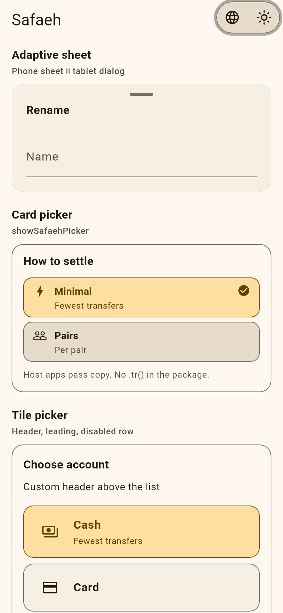
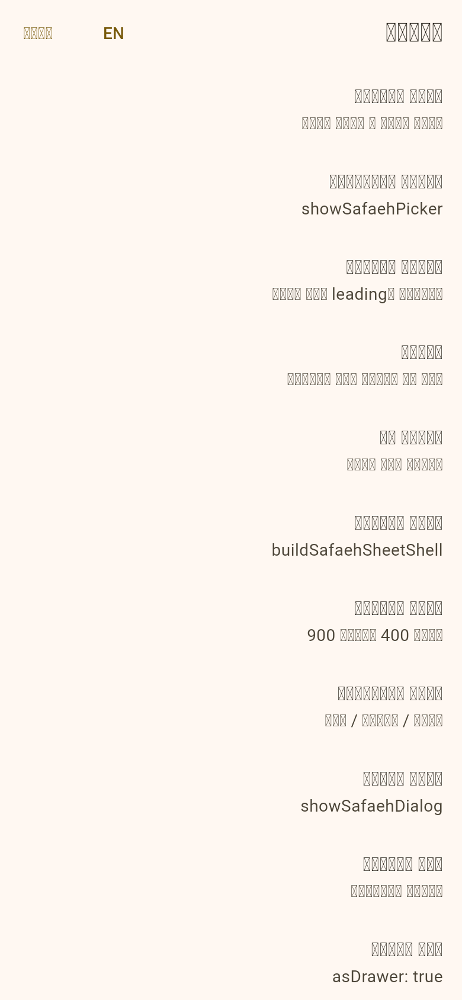
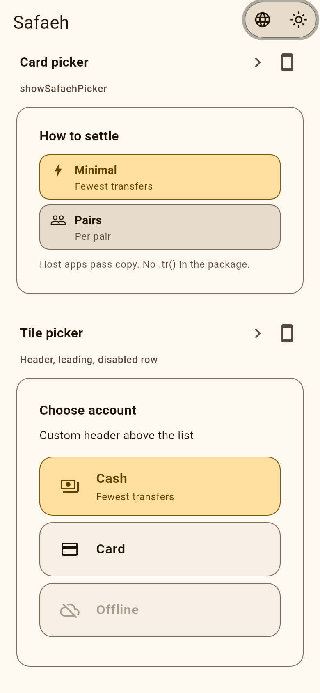
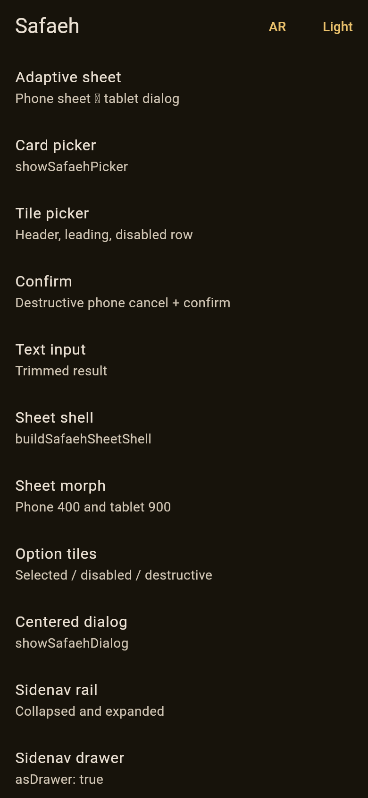
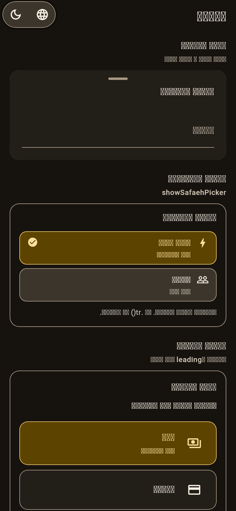
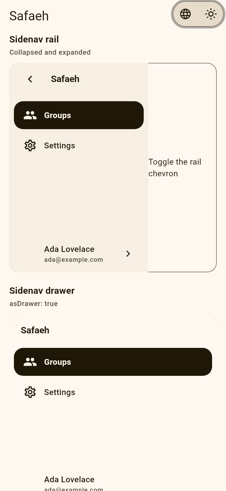
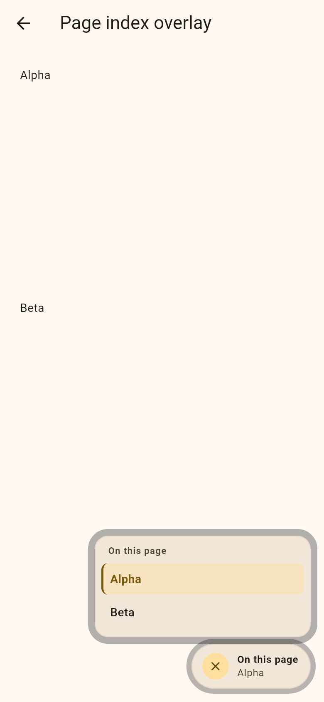

<!-- markdownlint-disable MD033 MD060 -->

<div dir="rtl" lang="ar">

<p align="center">
  
</p>

<h1 align="center">صفائح — Safaeh</h1>

<p align="center">
  <span dir="ltr"><code>safaeh</code></span><br/>
  sheets متكيّفة، وchrome للكاميرا / QR، وpage index، وsidenav لـ Flutter —<br/>
  التطبيق المضيف يحتفظ بـ i18n والتوجيه وplugin الكاميرا.
</p>

<p align="center">
  <a href="https://github.com/Zyzto/Safaeh"></a>
  
  <a href="LICENSE"></a>
  
</p>

<p align="center">
  <a href="#التثبيت">Install</a> ·
  <a href="#ابدأ-في-دقائق">Quick start</a> ·
  <a href="#لقطات">Screenshots</a> ·
  <a href="#ماذا-تقدّم">Features</a> ·
  <a href="#ماذا-يبقى-في-التطبيق">Host app</a> ·
  <a href="#المثال">Example</a> ·
  <a href="https://zyzto.github.io/Safaeh/">المثال الحي</a> ·
  <a href="CHANGELOG.md">Changelog</a> ·
  <a href="VERSIONING.md">Versioning</a> ·
  <a href="docs/host-integration.md">Host integration</a>
  <br/>
  <a href="README.md"><span dir="ltr">English</span></a>
</p>

<p align="center">
  الاسم <span dir="ltr"><strong>safaeh</strong></span> من العربية
  <strong>صفائح</strong>
  (<span dir="ltr"><em>ṣafāʾiḥ</em></span>): sheets / plates —
  جمع <em>صفيحة</em> (<span dir="ltr"><em>ṣafīḥa</em></span>).
</p>

</div>

---

<div dir="rtl" lang="ar">

## لماذا؟

تطبيقات Flutter تجمع bottom sheets وdialogs وrails وoverlays للكاميرا متفرقة. ثم تحتاج:

- نفس الـ route يكون sheet على الهاتف وdialog على الجهاز اللوحي، ويتحوّل عند عبور نقطة العرض
- chrome يحترم <span dir="ltr"><code>MediaQuery.disableAnimationsOf</code></span>
- بلا <span dir="ltr"><code>easy_localization</code></span> أو Riverpod أو <span dir="ltr"><code>go_router</code></span> أو <span dir="ltr"><code>mobile_scanner</code></span> داخل الحزمة

**صفائح** هي طبقة الـ chrome هذه. حساب يغلّفها بـ <span dir="ltr"><code>UserText</code></span> وعرض الـ rail والصلاحيات وكاميرا / فك QR الحيّ.

المستودع: <span dir="ltr"><a href="https://github.com/Zyzto/Safaeh">Zyzto/Safaeh</a></span>. غير منشورة على <span dir="ltr">pub.dev</span>. حساب هو التطبيق المرجعي.

</div>

---

<div dir="rtl" lang="ar">

## لقطات

</div>

<p align="center">
  
  
  
</p>

<p align="center">
  <sub>كتالوج إنجليزي · عربي RTL · منتقي البطاقات</sub>
</p>

<details>
<summary>السمة الداكنة والمزيد</summary>

<p align="center">
  
  
  
  
</p>

<p align="center">
  <sub>إنجليزي داكن · عربي داكن · سكة · فهرس</sub>
</p>

</details>

---

<div dir="rtl" lang="ar">

## ماذا تقدّم؟

| المجال | ماذا تحصل |
|--------|-----------|
| **Sheets** | <span dir="ltr"><code>showSafaeh</code></span> يحوّل sheet الهاتف ↔ dialog الجهاز اللوحي؛ <span dir="ltr"><code>showSafaehPicker</code></span> / <span dir="ltr"><code>SafaehOption</code></span> (بطاقات، <span dir="ltr"><code>enabled</code></span>)؛ <span dir="ltr"><code>showSafaehTilePicker</code></span> / <span dir="ltr"><code>SafaehTileOption</code></span> (صفوف قائمة، <span dir="ltr"><code>header</code></span> / <span dir="ltr"><code>leading</code></span> / <span dir="ltr"><code>enabled</code></span>)؛ <span dir="ltr"><code>showSafaehConfirm</code></span>، <span dir="ltr"><code>showSafaehTextInput</code></span>، <span dir="ltr"><code>buildSafaehSheetShell</code></span>، <span dir="ltr"><code>SafaehOptionList</code></span>، <span dir="ltr"><code>SafaehOptionTile</code></span> |
| **Dialog** | <span dir="ltr"><code>showSafaehDialog</code></span> لوحة متمركزة مع <span dir="ltr"><code>railWidthOf</code></span> اختياري |
| **Theme** | <span dir="ltr"><code>SafaehTheme</code></span> / <span dir="ltr"><code>SafaehThemeData</code></span> لنقطة العرض والحركة ونصف القطر وعرض الـ rail وارتفاع الكاميرا المضغوط و<span dir="ltr"><code>contentMaxWidth</code></span>؛ <span dir="ltr"><code>copyWith</code></span> |
| **Motion** | <span dir="ltr"><code>safaehResolvedMotion</code></span> يصفر المدد عندما تُعطَّل الحركات |
| **Nav** | <span dir="ltr"><code>SafaehSidenav</code></span> درج مؤقت (<span dir="ltr"><code>asDrawer: true</code></span>) أو rail قصّ؛ <span dir="ltr"><code>SafaehFloatingNavBar</code></span> (نفس <span dir="ltr"><code>SafaehSidenavDestination</code></span>) |
| **Page index** | <span dir="ltr"><code>SafaehPageIndex</code></span> وoverlay و<span dir="ltr"><code>scrollToPageSection</code></span> و<span dir="ltr"><code>safaehActivePageSectionId</code></span> (معرفات + مفاتيح فقط — بلا <span dir="ltr"><code>.tr()</code></span> أثناء التمرير) |
| **Content** | <span dir="ltr"><code>safaehBandMetrics</code></span>، <span dir="ltr"><code>SafaehContentBand</code></span>، <span dir="ltr"><code>SafaehEndAsideLayout</code></span>، <span dir="ltr"><code>SafaehContentAlignedAppBar</code></span>، <span dir="ltr"><code>SafaehContentAlignedFabLocation</code></span> |
| **Camera** | <span dir="ltr"><code>showSafaehCameraSheet</code></span> / <span dir="ltr"><code>SafaehCameraSheetHost</code></span> لفة ورق مضغوط ↔ كامل |
| **QR chrome** | <span dir="ltr"><code>SafaehQrScannerOverlay</code></span>، <span dir="ltr"><code>SafaehQrTopBar</code></span>، <span dir="ltr"><code>SafaehQrMessageBody</code></span>، <span dir="ltr"><code>SafaehQrFramePainter</code></span> |

**Core:** Flutter Material فقط. المعاينة وفك الشفرة والنصوص والتوجيه تبقى في التطبيق المضيف.

</div>

---

<div dir="rtl" lang="ar">

## التثبيت

وسم git (وليس <span dir="ltr"><code>main</code></span>):

</div>

```yaml
dependencies:
  safaeh:
    git:
      url: https://github.com/Zyzto/Safaeh.git
      ref: v0.1.0
```

```dart
import 'package:safaeh/safaeh.dart';
```

<div dir="rtl" lang="ar">

الإصدار الحالي: **0.1.0**. انظر <span dir="ltr"><a href="CHANGELOG.md">CHANGELOG.md</a></span> و<span dir="ltr"><a href="VERSIONING.md">VERSIONING.md</a></span>. <span dir="ltr"><code>publish_to: none</code></span> — ليست على <span dir="ltr">pub.dev</span>.

</div>

---

<div dir="rtl" lang="ar">

## ابدأ في دقائق

### 1. غلّف التطبيق

</div>

```dart
SafaehTheme(
  data: const SafaehThemeData(
    tabletBreakpoint: 600,
    dialogMaxWidth: 560,
  ),
  child: MaterialApp(
    home: const MyHome(),
  ),
);
```

<div dir="rtl" lang="ar">

مواقع الاستدعاء ما زالت تستطيع تجاوز نقطة العرض والحركة والانتقالات.

### 2. Sheet متكيّف

</div>

```dart
await showSafaeh<void>(
  context: context,
  title: 'Rename',
  titleBuilder: (context, style) => Text('Rename', style: style),
  child: const TextField(),
);
```

<div dir="rtl" lang="ar">

الهاتف: bottom sheet. الجهاز اللوحي+: dialog متمركز. نفس الـ route يتحوّل عندما يتجاوز العرض <span dir="ltr"><code>tabletBreakpoint</code></span>.

### 3. Option picker

</div>

```dart
final choice = await showSafaehPicker<int>(
  context: context,
  title: 'How to settle',
  selected: 1,
  options: const [
    SafaehOption(
      value: 1,
      label: 'Minimal',
      subtitle: 'Fewest transfers',
      icon: Icons.bolt_outlined,
    ),
  ],
);
```

<div dir="rtl" lang="ar">

عنوان الجسم يُخفى عندما يكون العرض واسعاً (عنوان الرأس فقط).
<span dir="ltr"><code>SafaehOption.enabled</code></span> يخفت البطاقة ويتجاهل النقر.

### 4. Tile picker (صفوف قائمة)

```dart
final mode = await showSafaehTilePicker<String>(
  context: context,
  title: 'Import mode',
  titleBuilder: (context, style) => Text('Import mode', style: style),
  header: const Text('12 new · 3 updated'),
  selected: 'add',
  options: const [
    SafaehTileOption(
      value: 'add',
      label: 'Add copies',
      subtitle: 'Keeps existing data',
      leading: Icon(Icons.add_circle_outline),
    ),
    SafaehTileOption(
      value: 'replace',
      label: 'Replace',
      enabled: false,
    ),
  ],
);
```

يستخدم <span dir="ltr"><code>SafaehOptionList</code></span> + <span dir="ltr"><code>SafaehOptionTile</code></span>. التطبيقات التي تغلف <span dir="ltr"><code>showSafaeh</code></span> يمكنها وضع <span dir="ltr"><code>SafaehTilePickerBody</code></span> كطفل. نفس خيارات <span dir="ltr"><code>showSafaeh*</code></span> (<span dir="ltr"><code>railWidthOf</code></span>، <span dir="ltr"><code>motion</code></span>، …).

### 5. تأكيد وإدخال نص

التطبيق المضيف يمرّر كل التسميات. الهاتف يعرض إلغاء في صف الإجراءات؛ الجهاز اللوحي يستخدم زر إغلاق الـ sheet.

```dart
final ok = await showSafaehConfirm(
  context: context,
  title: 'Delete item',
  content: 'This cannot be undone.',
  confirmLabel: 'Delete',
  cancelLabel: 'Cancel',
  isDestructive: true,
  titleBuilder: (context, style) => Text('Delete item', style: style),
);

final name = await showSafaehTextInput(
  context: context,
  title: 'Tag name',
  doneLabel: 'Done',
  cancelLabel: 'Cancel',
  titleBuilder: (context, style) => Text('Tag name', style: style),
);
```

### 6. Dialog متمركز

```dart
await showSafaehDialog<void>(
  context: context,
  railWidthOf: (context) => 0,
  builder: (context) => const Card(child: Text('Hello')),
);
```

### 7. شريط تنقّل عائم وشريط محتوى

```dart
SafaehFloatingNavBar(
  selectedIndex: index,
  onDestinationSelected: (i) => setState(() => index = i),
  destinations: const [
    SafaehSidenavDestination(
      label: 'Home',
      icon: Icons.home_outlined,
      selectedIcon: Icons.home,
    ),
  ],
);

SafaehContentBand(
  aside: const Text('On this page'),
  child: body,
);
```

<div dir="rtl" lang="ar">

<span dir="ltr"><code>SafaehContentBand</code></span> يتمركز من قيود العرض الواردة ويُخفي <span dir="ltr"><code>aside</code></span> عندما يكون العرض ضيقاً. التطبيقات ذات rail شقيق (حساب) تبقي حساب <span dir="ltr"><code>leftOffset</code></span> / <span dir="ltr"><code>bandWidth</code></span> وتستخدم <span dir="ltr"><code>SafaehEndAsideLayout</code></span>.

مقاييس الشريط للتطبيقات الأخرى (شريط التطبيق، FAB، aside):

```dart
final metrics = safaehBandMetrics(
  contentAreaWidth: constraints.maxWidth,
  maxWidth: 600,
);

SafaehContentAlignedAppBar(
  leftOffset: metrics.leftOffset,
  bandWidth: metrics.bandWidth,
  title: const Text('Title'),
);

SafaehContentAlignedFabLocation.resolve(
  leftOffset: metrics.leftOffset,
  bandWidth: metrics.bandWidth,
  endFree: metrics.endFree,
  textDirection: Directionality.of(context),
);
```

انظر <span dir="ltr"><a href="docs/host-integration.md">docs/host-integration.md</a></span>.

### 8. Chrome الكاميرا / QR

</div>

```dart
await showSafaehCameraSheet<void>(
  context: context,
  builder: (context, sheet) => MyPreview(
    expanded: sheet.expanded,
    onToggle: sheet.toggleExpanded,
    onClose: sheet.dismiss,
  ),
);
```

<div dir="rtl" lang="ar">

ضمّنه في مسار عبر <span dir="ltr"><code>SafaehCameraSheetHost</code></span> (احذف <span dir="ltr"><code>openAnimation</code></span>، مرّر <span dir="ltr"><code>onDismiss</code></span>). غطِّ الماسح بـ <span dir="ltr"><code>SafaehQrScannerOverlay</code></span> — أبقِ <span dir="ltr"><code>mobile_scanner</code></span> في التطبيق.

</div>

---

<div dir="rtl" lang="ar">

## ماذا يبقى في التطبيق؟

| المجال | يبقى في التطبيق |
|--------|-----------------|
| النصوص | <span dir="ltr"><code>easy_localization</code></span>، <span dir="ltr"><code>UserText</code></span>، <span dir="ltr"><code>titleBuilder</code></span> |
| التوجيه | <span dir="ltr"><code>go_router</code></span>، عرض الـ rail المحجوز عبر <span dir="ltr"><code>railWidthOf</code></span> |
| الكاميرا | <span dir="ltr"><code>mobile_scanner</code></span>، الصلاحيات، قفل الاتجاه عبر <span dir="ltr"><code>SystemChrome</code></span> |
| الحالة | Riverpod / ما يستخدمه التطبيق أصلاً |
| Tiles | <span dir="ltr"><code>UserText</code></span> + ألوان لكنة اختيارية على <span dir="ltr"><code>SafaehOptionTile</code></span> (<span dir="ltr"><code>SheetOptionTile</code></span> في حساب) |

حساب ما زال يمرّر مفاتيح <span dir="ltr"><code>shell_nav_*</code></span> إلى <span dir="ltr"><code>SafaehSidenav</code></span> حتى تبقى اختبارات الـ widget الحالية خضراء.

</div>

---

<div dir="rtl" lang="ar">

## جرد الـ UI

**Sheets:** <span dir="ltr"><code>showSafaeh</code></span>، <span dir="ltr"><code>showSafaehPicker</code></span>، <span dir="ltr"><code>SafaehOption</code></span>، <span dir="ltr"><code>showSafaehTilePicker</code></span>، <span dir="ltr"><code>SafaehTileOption</code></span>، <span dir="ltr"><code>SafaehTilePickerBody</code></span>، <span dir="ltr"><code>showSafaehConfirm</code></span>، <span dir="ltr"><code>SafaehConfirmSheet</code></span>، <span dir="ltr"><code>showSafaehTextInput</code></span>، <span dir="ltr"><code>SafaehTextInputSheet</code></span>، <span dir="ltr"><code>buildSafaehSheetShell</code></span>، <span dir="ltr"><code>SafaehOptionList</code></span>، <span dir="ltr"><code>SafaehOptionTile</code></span>، <span dir="ltr"><code>kSheetContentPadding</code></span>

**Dialog:** <span dir="ltr"><code>showSafaehDialog</code></span>

**Camera:** <span dir="ltr"><code>showSafaehCameraSheet</code></span>، <span dir="ltr"><code>SafaehCameraSheetHost</code></span>، <span dir="ltr"><code>SafaehCameraSheet</code></span>، <span dir="ltr"><code>SheetHandleBar</code></span>، <span dir="ltr"><code>SheetHandleDrag</code></span>

**QR:** <span dir="ltr"><code>SafaehQrScannerOverlay</code></span>، <span dir="ltr"><code>SafaehQrTopBar</code></span>، <span dir="ltr"><code>SafaehQrMessageBody</code></span>، <span dir="ltr"><code>SafaehQrFramePainter</code></span>

**Shell:** <span dir="ltr"><code>SafaehSidenav</code></span>، <span dir="ltr"><code>SafaehSidenavDestination</code></span>، <span dir="ltr"><code>SafaehSidenavProfile</code></span>، <span dir="ltr"><code>SafaehFloatingNavBar</code></span>، <span dir="ltr"><code>SafaehPageIndex</code></span>، <span dir="ltr"><code>SafaehPageIndexOverlay</code></span>، <span dir="ltr"><code>scrollToPageSection</code></span>، <span dir="ltr"><code>safaehActivePageSectionId</code></span>، <span dir="ltr"><code>safaehBandMetrics</code></span>، <span dir="ltr"><code>SafaehContentBand</code></span>، <span dir="ltr"><code>SafaehEndAsideLayout</code></span>، <span dir="ltr"><code>SafaehContentAlignedAppBar</code></span>، <span dir="ltr"><code>SafaehContentAlignedFabLocation</code></span>

**Tokens:** <span dir="ltr"><code>SafaehTheme</code></span>، <span dir="ltr"><code>SafaehThemeData</code></span>، <span dir="ltr"><code>SafaehThemeData.copyWith</code></span>، <span dir="ltr"><code>safaehResolvedMotion</code></span>، <span dir="ltr"><code>kSafaehCameraCompactHeightFraction</code></span>

</div>

---

<div dir="rtl" lang="ar">

## Architecture

</div>

```
┌─────────────────────────────────────────────────────────────┐
│         Host app (i18n, GoRouter, camera, UserText)         │
└─────────────────────────────┬───────────────────────────────┘
                              │
┌─────────────────────────────▼───────────────────────────────┐
│                      SafaehTheme                             │
│   breakpoint · motion · radius · rail · camera fraction     │
└─────────────────────────────┬───────────────────────────────┘
                              │
┌─────────────────────────────▼───────────────────────────────┐
│  showSafaeh / picker / confirm / text / dialog              │
│  SafaehSidenav · floating nav · page index · content band   │
│  camera sheet host · QR overlay chrome                      │
└─────────────────────────────┬───────────────────────────────┘
                              │
┌─────────────────────────────▼───────────────────────────────┐
│              Flutter Material (no Riverpod)                 │
└─────────────────────────────────────────────────────────────┘
```

---

<div dir="rtl" lang="ar">

## المثال

كتالوج بلا Riverpod في <span dir="ltr"><a href="example/"><code>example/</code></a></span> — نفس تقسيم <span dir="ltr"><a href="https://github.com/Zyzto/Edadat">Edadat</a></span>: <span dir="ltr"><code>catalog.dart</code></span> (نصوص EN/AR)، <span dir="ltr"><code>app.dart</code></span>، وصفحة لكل API عام. تبديل لغة وسمة، بلا <span dir="ltr"><code>mobile_scanner</code></span>.

المثال على الويب: <span dir="ltr"><a href="https://zyzto.github.io/Safaeh/">zyzto.github.io/Safaeh</a></span>

```bash
cd example && dart analyze && flutter test
```

<span dir="ltr"><code>example/test/screenshots_test.dart</code></span> يكتب PNG إلى <span dir="ltr"><a href="screenshots/"><code>screenshots/</code></a></span>.

حساب هو التطبيق المرجعي: <span dir="ltr"><code>lib/app.dart</code></span> يثبّت <span dir="ltr"><code>SafaehTheme</code></span>، و<span dir="ltr"><code>showResponsiveSheet</code></span> يغلّف <span dir="ltr"><code>showSafaeh</code></span>، وكاميرا الإيصال / ماسح الدعوة يغلّفان <span dir="ltr"><code>showSafaehCameraSheet</code></span>.

اختبارات الحزمة:

</div>

```bash
dart analyze && flutter test
```

---

<div dir="rtl" lang="ar">

## Branding

كلمة الشعار بخط <span dir="ltr"><strong><a href="https://www.1001fonts.com/baz-font.html">Baz</a></strong></span> (Baz Light) — نفس الـ typeface العربي في <span dir="ltr"><a href="https://github.com/Zyzto/Edadat">Edadat</a></span> و<span dir="ltr"><a href="https://github.com/Zyzto/Siglat">Siglat</a></span>. ملف الـ SVG يضم <strong>صــفائح</strong> كـ outlines (تطويل بعد <em>ص</em>) حتى يظهر على GitHub دون تحميل الخط.

</div>

---

<div dir="rtl" lang="ar">

## الرخصة

<span dir="ltr"><a href="LICENSE">MPL-2.0</a></span> — weak copyleft، الاستخدام التجاري مسموح. ملفات الحزمة المعدّلة تبقى تحت MPL؛ تطبيقك يمكن أن يبقى closed-source.

مستودع مستقل (<span dir="ltr"><code>publish_to: none</code></span>). حساب كعمل أكبر يبقى AGPL ويعتمد على وسم git.

</div>
